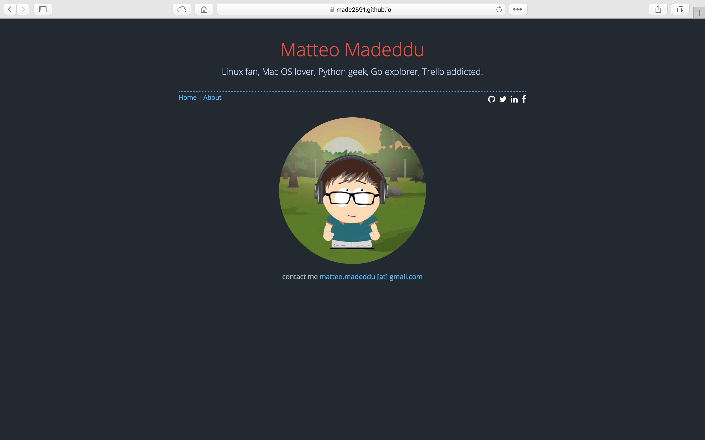
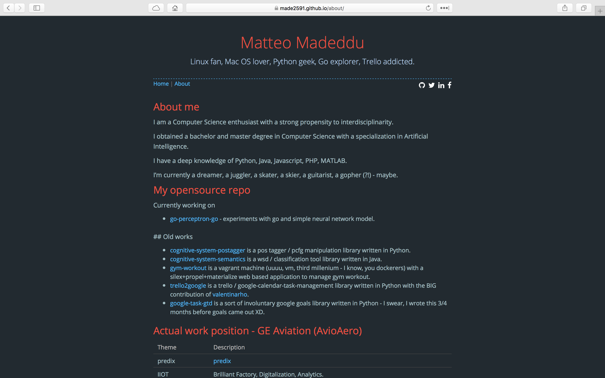

# My personal Github page

My personal [github page](https://made2591.github.com). Build with [Jekyll](http://jekyllrb.com/) and [Autm-rb](https://github.com/kirqe/autm-rb). Thanks to [kirqe](https://github.com/kirqe).

## Screens

## Homepage

## About page

## Thanks

[pages](http://pages.github.com)

[idea](https://github.com/kirqe)

## Licensing

[MIT](https://github.com/railsr/autm-rb/blob/master/LICENSE)

[fork](https://github.com/railsr/autm-rb/fork)

[demo](http://kirqe.github.io/autm-rb/)